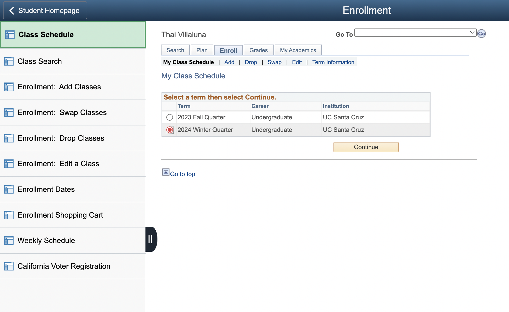
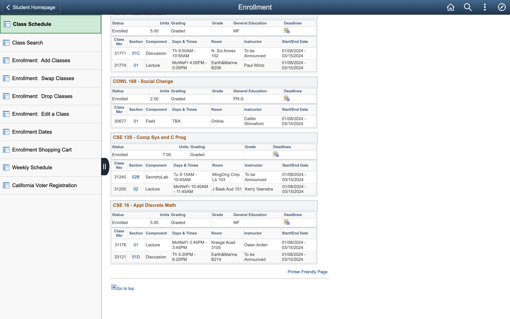
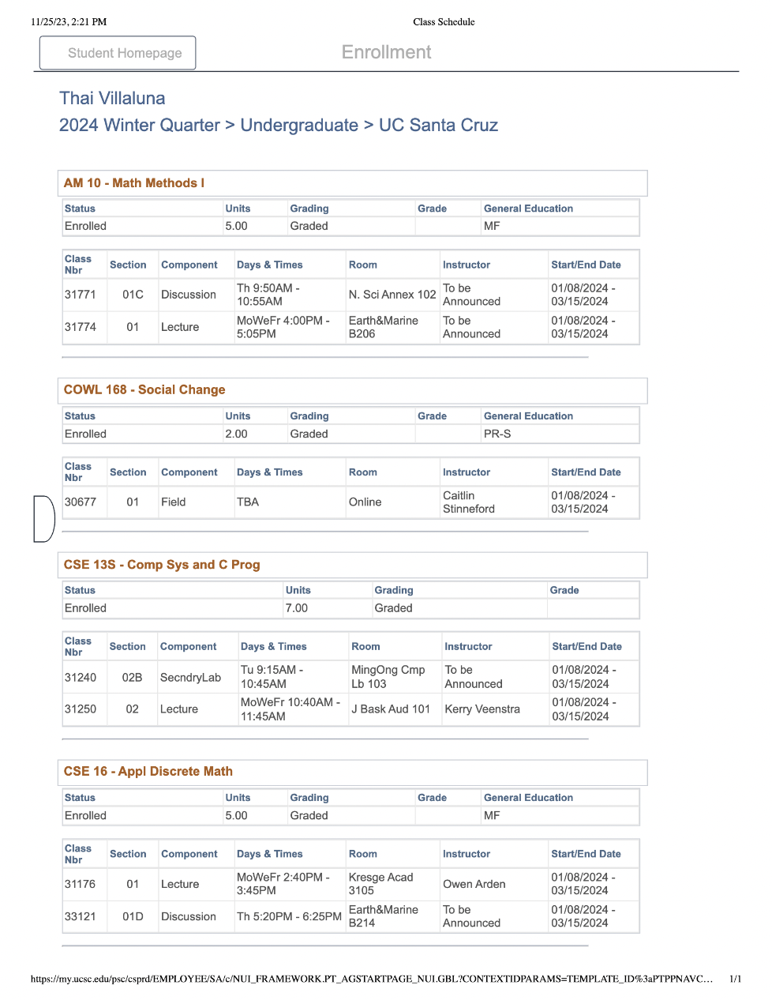

# Upload Course Schedule

### Instructions
1. On your MyUCSC homepage, navigate to Enrollment > Class Schedule
2. Click on the term corresponding to the desired quarter.
3. Scroll to the bottom of this page, and hit 'Printer Friendly Page'
4. Click on the side tab to hide the left navigation area. 
5. Save this page as pdf by clicking Ctrl+P or Cmd+P on mac
6. Rename pdf to 'schedule.pdf' and place in `files` directory

### Images

  
Step 1: Navigate to Enrollment on MyUCSC

Step 3: Scroll and click Printer Friendly Page.

Step 4: Click on the black tab on the left of your screen to close the side tab.

Step 5: Save the page as a pdf. The result should look like this. 

Multiple pages is okay.
